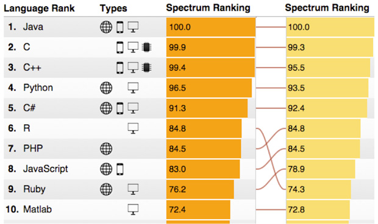
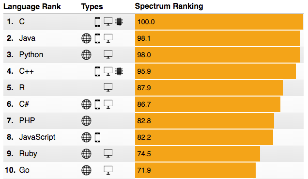

# WELCOME!

```{r, echo=FALSE}
source('../resources/setup.R')
``` 

## This Presentation Covers...

- How to install the R toolchain for data science

    + The R project for statistical computing

    + The RStudio integrated development environment (IDE)

    + The Rtools suite of compilers (optional)

        - Required for building R packages containing compiled code
        
        - Required for installing R packages from GitHub containing compiled code

    + Git/GitHub (optional)

        - Easily collaborate on <a target=' ' href='https://support.rstudio.com/hc/en-us/articles/200526207-Using-Projects'>Rprojects</a> with other programmers

        - Seamlessly integrates with RStudio
        
- The basics of R

    + What R is and how R differs from many other languages

    + Advantages and disadvantages of using R
    
    + Creating and manipulating R objects

    + Accessing help resources

- Literate programming with Rmarkdown

    + Render `code`, text, images, and <focus>$\mathscr{equations}$</focus> simultaneously in documents & presentations

# WHAT IS R? 

## In a Nutshell, R is...

- An <font color="blue">__open-source__</font>, <font color="green">__interpreted__</font> computer language and suite of statistical operators for calculations on vectors and matrices

- An integrated collection of tools and graphical facilities for data analysis and reproducible research

- A well-developed programming language which includes conditionals, loops, user-defined recursive functions, and input-output facilities

- One of the fastest growing technical programming languages in the world

## IEEE Ranking Of Top Programming Languages 

<div id='container2'>
<div id='container1'>
<div id='col1'>
<center><u>2015 Rankings</u></center>
[](http://spectrum.ieee.org/static/interactive-the-top-programming-languages-2015)
</div>

<div id='col2'>
<center><u>2016 Rankings</u></center>
[](http://spectrum.ieee.org/computing/software/the-2016-top-programming-languages)
</div>
</div>
</div>

## Where Did R Come From?

- The S programming language

    + Computing language originally developed at Bell Labs (1976) for data analysis 

    + Licensed by AT&T/Lucent to Insightful Corp. under the product name: S-Plus.

- The R programming language

    + Written by two statisticians <u><font color="blue">__R__</font></u>oss Ihaka and <u><font color="blue">__R__</font></u>obert Gentleman at the University of Auckland 

    + Released as an open source implementation of the S language (R plays on name "S")
    
    + Since 1997: international R-core team (~15 people) and thousands of code writers and statisticians share their work via R packages

    + R packages work like apps for smartphones - making it more useful

    + Currently, `r length(available.packages(repos = 'https://cran.rstudio.com/')[,2])` packages are available on the Comprehensive R Archive Network (CRAN) 


# HOW DOES R COMPARE TO OTHER LANGUAGES

## R vs. Proprietary Source Languages

<div id='container2'>
<div id='container1'>
<div id='col1'>
<center><u>Proprietary Source</u></center>

- Methodical updates (annually/bi-annually)

- Consistent syntax/user experience across all functions

- Single learning curve to becoming proficient

- Strategic improvements, carefully implemented 

- Won't alienate legacy users with drastic changes 

- Newest methods may not be available for a while 

- Expensive
</div>

<div id='col2'>
<center><u>R (Open Source)</u></center>

- Fast updates - newest capabilities are released every day

- Strategic improvements to R-Core 

- Package authors are independent - proceed in their own directions

- Flexible syntax - often NOT consistent

- Multiple learning curves for different packages

- Legacy users often frustrated with fast-paced changes

- <green>Free</green>
</div>
</div>
</div>

# ADVANTAGES AND DISADVANATAGES OF USING R

## Advantages

- Only open-source language with a standardized set of development tools to extend the environment

- Gives full access to the programming environment, easily see what functions are doing, fix bugs, and extend software

- Promotes reproducible research by providing open and accessible tools for data analysis and reporting

- Provides a forum allowing researchers to explore and expand the methods used to analyze data

- Scientists around the world are the co-owners to the software tools needed to carry out research

- The product of thousands of experts in many fields - **R is CUTTING EDGE**

## Disadvantages

- Many percieve the R learning curve to be steep, minimal GUI<br><font color="red">__Addressed by RStudio__</font>

    + In reality, R's learning curve is no steeper than that of any other language

    + R has a <focus>flexible</focus> syntax - that's not always consistent

- Little commercial support; new users complain of hostility on R help sites

- Figuring out correct methods to use a function on your own can be frustrating

- Working with large datasets is limited by RAM<br><red>__Addressed by data.table package__</red>

- Data prep can be messier and more mistake prone in R vs. SPSS or SAS<br><red>__Addressed by dplyr and tidyr pacakges__</red>


# IS R FAST? (YES AND NO)

## Human efficiency vs. Machine efficiency

- R is a fast language that has been <focus>purposefully</focus> implemented in such a way as to make it run slower

- Recall, R was written by statisticians - for statisticians

- Many languages are designed to produce numerical results as fast as possible <focus>Machine efficiency</focus> 

    + Compiled languages like C, C++, and FORTRAN can produce numerical results extremely fast (about 30-60x faster than R)

    + However, compiled code can be difficult to for statisticians and non-developers work with
    
- R was built to help non-developers produce results and high quality graphics fast  <focus>human efficiency</focus> 

# UNDERSTANDING THE R ENVIRONMENT

## Basic Structure of R

- R was initially created as a functional programming language but has since taken on attributes of an object-oriented programming

- To understand computations in R, remember these five things

    + 1) Everything that exists is an <red>object</red>...almost

    + 2) Everything that happens is a <orange>function call</orange>

    + 3) Function call means that a function-class object "calls" a particular <green>method</green>

    + 4) Every object and function call has an associated <blue>environment</blue>

    + 5) <purple>Lexical scoping rules</purple> define how objects and functions can interact


## Everything in R is an OBJECT...Almost

- Functions, vectors, datasets, character strings... are stored as objects

- Graphics are written out and are NOT stored as objects

- Objects are classified by two criteria:

    + MODE: how objects are stored in R - character, numeric, logical, factor, list, & function 

    + CLASS: how objects are treated by functions - vector,list, matrix, array, data frame & hundreds of other classes created by specific functions

- Scripting is the process of matching objects and function calls such that the desired output objects (e.g., statistical results) and graphics are returned. 


### Assigning names to objects - R is CasE sENsItiVE!!

- R has three methods to assign names to objects

    + Left assignment `<-`

    + Left deep assignment `<<-`

    + Right assigment `->`

    + Right deep assignment `->>`

    + Equals sign `=`

- In most cases R treats each of these assignment methods the same, however the R style guide provide a best practice to ensure consistency

    + Use `<-` and `->` to define objects (i.e. `x <- 4`)

    + Use `=` to assign values to function arguments (i.e. `sqrt(x = 4)`)

    + The use of `<<-` and `->>` should be minimized as it can have unintended side effects (if you don't know what is does don't use it)

- Object naming rules 

    + Variable names can only contain letters and numbers separated by "." or "_"

    + Variable Names <u>CANNOT</u> begin with a number

```{r,echo=TRUE,results='hide'} 
var <- 5  ### Left assignment
```

```{r,echo=TRUE,results='hide'} 
200 -> Var ### Right assignment
```

```{r,echo=TRUE,results='hide'} 
meaning.of_life = 42 ### Or equal sign
```

```{r,echo=TRUE, results='markup'} 
var; Var; meaning.of_life
```

# HELPFUL FUNCTIONS

## Functions to access R object properties

- There are several functions to view the properties of an object

```{r,echo=TRUE,eval=FALSE}
mode(object.name)  ### Returns an object's mode 
```

```{r,echo=TRUE,eval=FALSE}
class(object.name) ### Returns an object's class
```

```{r,echo=TRUE,eval=FALSE}
attributes(object.name) ### Returns any attributes associated with an object
```

```{r,echo=TRUE,eval=FALSE}
str(object.name) ### Returns a complete list of properties assigned to an object
```

<center><u><font color="red">**str( ) is every R users best friend**</font></u></center>

## Functions to manage active objects

- Errors can result if you accidentally overwrite an object in the current environment 

- These functions are helpful for managing objects defined in the current working environment 

```{r,echo=TRUE,eval=FALSE}
ls( ) ### Returns a list of active objects in the current working environment
```

```{r,echo=TRUE,eval=FALSE}
rm( ) ### Removes an object from the current working environment
```

```{r,echo=TRUE,eval=FALSE}
rm(list = ls()) ### Removes all objects from the current working environment (use carefully)
```

## Functions to manage your local file structure 

- Errors can result if a script, saved in one file location, calls a file in another location

- These functions are helpful for managing your local file structure

- Additionally, creating projects in RStudio can help avoid these errors

```{r,echo=TRUE,eval=FALSE}
getwd( ) ### Returns the location of the current working directory
```

```{r,echo=TRUE,eval=FALSE}
setwd("C:/Users/Desktop") ### Reassigns the location of the working directory
```

```{r,echo=TRUE,eval=FALSE}
file.choose( ) ### Opens a new file explorer window to choose a file
```

## Help Resources Within R

```{r,echo=TRUE,eval=FALSE} 
?cos ### Searches the local package library for "cos"
```

```{r,echo=TRUE,eval=FALSE} 
??xyz ### Searches the full R documentation for "xyz" - also help(xyz)
```

```{r,echo=TRUE,eval=FALSE} 
vignette() ### Lists "how-to" demos available for each package in the library
```

```{r,echo=TRUE,eval=FALSE} 
help.search("t.test") ### Provides a categorized search of R documentation for "t.test"
```

## Online Resources for Help

- Quick R <b><http://www.statmethods.net/></b>

    - Expands upon book: <u>*R in Action*</u> 2nd ed., Robert I. Kabacoff August, 2011, Mannings Publication Company, ISBN 9781935182399

- R-bloggers <b><http://www.r-bloggers.com/></b>

    - An aggregation of content collected from bloggers who write about R to help R users connect and follow the "R blogosphere" 

- StackOverflow <b><http://stackoverflow.com/questions/tagged/r/></b>

    - A question and answer site for professional and enthusiast programmers

